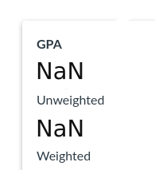
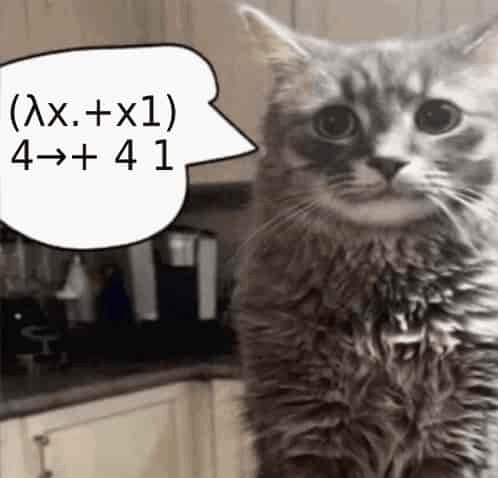

# ithinkihave 🤔

A small Discord bot for the "i think i have" server. It mixes community moderation, joke reactions, and a couple of image-generating slash commands. 🤖

## What it does

- 🏷️ Renames the server when a message matches the "i think i have..." pattern.
- 💬 Replies to "is this true?" style messages in English and Chinese.
- 🇨🇳 Deletes non-Chinese or suspicious ASCII-art-style messages in the dedicated Chinese channel.
- 😊 Enforces positive sentiment in one specific channel.
- 💬 Replies to keyword matches like `guh`.
- ♟️ Randomly reacts with chess-themed custom emoji.
- 🖼️ Provides `/gpa` and `/glup` slash commands that render text onto meme templates.

## Commands 🕹️

### `/gpa` 📊

Renders the provided text onto the GPA template image and returns a single-frame GIF.

Example:

```text
/gpa text: NaN
```



### `/glup` 💬

Renders wrapped text into the glup speech bubble. You can optionally provide a custom image template.

Example:

```text
/glup text: (λx.+x1)4→+ 4 1
```



## Message behaviors 💌

### 🏷️ Server rename

If a message starts with one of these patterns, the bot may rename the server:

- `i think i have ...`
- `我想我有 ...`
- `我觉得我有 ...`
- `i think ... austin`
- `我想 ... austin`
- `我觉得 ... austin`

### ✅ Truth replies

The bot answers messages like:

- `is this true?`
- `is it real`
- `这是真的吗`
- `真的假的`

In one restricted guild, this only runs inside the `is-this-true` area.

### 🇨🇳 Chinese-only channel moderation

In the configured Chinese channel, the bot deletes messages that:

- contain non-Chinese characters outside a small allowed set
- contain attachments
- fail the Han-character ratio check
- look like ASCII art or repeated-character spam

### 😊 Happy channel moderation

In the configured "happy" channel, messages are scored with `natural` sentiment analysis:

- positive-enough messages get a 👍 reaction
- messages with sentiment scores below `0.2` are deleted 🗑️

## Tech stack 🛠️

- Node.js `v22+` 🟢
- discord.js 💬
- sharp 🖼️
- natural 🌿

## Setup ⚙️

### 1. Install dependencies 📦

```bash
npm install
```

### 2. Create a `.env` file 🔐

```env
TOKEN=your_discord_bot_token
COMMAND_GUILD_ID=your_test_or_target_guild_id
```

Notes:

- `TOKEN` is required.
- `COMMAND_GUILD_ID` is optional. If omitted, the bot falls back to the built-in server ID in the code.

### 3. Start the bot 🚀

```bash
npm start
```

When the bot comes online, it registers the `/gpa` and `/glup` slash commands for the configured guild.

## Tests 🧪

Run the test suite with:

```bash
npm test
```

Current tests cover:

- 🔍 truth-question matching
- 🇨🇳 Chinese-channel filtering rules
- 🔑 keyword matching
- 🏷️ server rename matching
- 😊 sentiment analysis
- 🖼️ image text layout helpers

## Configuration notes 📝

This bot is currently tailored to one Discord server. Several values are hard-coded in the source, including:

- guild IDs
- channel IDs
- role IDs
- custom emoji IDs
- template images

If you want to reuse it in another server, start by reviewing [index.js](index.js) and the files in [lib](/lib). 🔧
